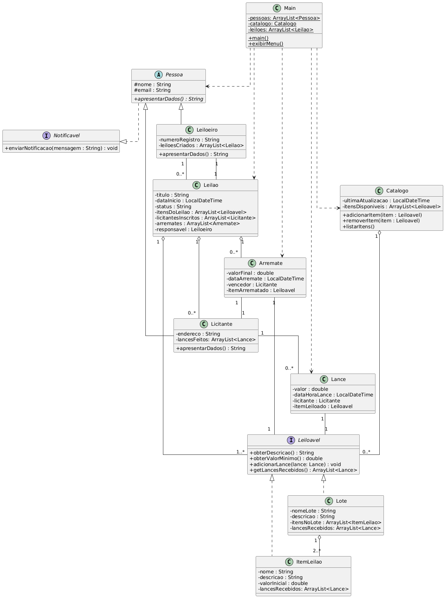

# Sistema de Leilão – Projeto Java Orientado a Objetos

## 📚 Descrição

Este projeto foi desenvolvido como exercício de programação orientada a objetos na disciplina de Programação de Soluções Computacionais. O objetivo é simular um sistema de leilão eletrônico, permitindo o cadastro e a gestão completa de leiloeiros, licitantes, itens, lotes, lances, arremates e leilões, utilizando conceitos avançados de POO em Java.

---

## 👥 Integrantes do Grupo

- Gabriel de Assunção Scharb
- João Vitor Fraga

---

## 🎯 Funcionalidades

- **Gestão de Pessoas (Leiloeiros e Licitantes):**
  - Cadastro, listagem, edição e exclusão.

- **Gestão do Catálogo (Itens e Lotes):**
  - Adição de itens individuais ou lotes (agrupamento de itens).
  - Listagem de todos os itens disponíveis no catálogo.
  - Edição de itens e lotes.
  - Exclusão de itens e lotes do catálogo.

- **Gestão de Lotes:**
  - Um lote deve conter no mínimo 2 itens.
  - Menu específico para gerenciar um lote, permitindo:
    - Listar os itens contidos no lote.
    - Editar o nome ou itens do lote.
    - Adicionar ou remover itens (respeitando o limite mínimo).

- **Gestão de Leilões:**
  - Criação de leilões, associando-os a um leiloeiro responsável.
  - Listagem de todos os leilões ativos e seus status.
  - Exclusão de leilões, com a devolução segura dos itens ao catálogo.
  - Menu de gerenciamento para cada leilão, permitindo:
    - Adicionar itens do catálogo ao leilão.
    - Inscrever licitantes.
    - Listar os licitantes inscritos.
    - Listar os itens do leilão.
    - Iniciar o processo de lances.

- **Relatórios:**
  - Visualização de um relatório completo com todos os arremates realizados.

---

## 🧩 Estrutura e Requisitos Atendidos

- **10+ Classes Java** (contando com Main)
- **2+ atributos por classe**
- **Herança**:
  - `Leiloeiro` e `Licitante` herdam da classe abstrata `Pessoa`.
- **Abstração**:
  - `Pessoa` é uma classe abstrata e define o método abstrato `apresentarDados()`.
- **Interfaces**:
  - `Leiloavel`: Implementada por `ItemLeilao` e `Lote`, permitindo o tratamento polimórfico.
  - `Notificavel`: Implementada por `Pessoa`, garantindo um contrato para envio de notificações.
- **Polimorfismo**:
  - `apresentarDados()` é sobrescrito nas subclasses de `Pessoa`.
  - Uso polimórfico de `Leiloavel` para manipulação genérica de itens e lotes em listas.
- **Relacionamentos**:
  - **Um-para-Muitos**: Leiloeiro → Leilão, Leilão → Itens/Lotes, Leilão → Licitantes.
  - **Muitos-para-Muitos**: Leilão ↔ Licitantes/Lances.
- **Dados em `ArrayList`** de objetos para todas as coleções.
- **CRUD Completo** para todas as principais entidades do sistema.
- **Sem dados pré-cadastrados** – tudo é inserido manualmente pelo operador e salvo em memória.
- **Organização em múltiplos arquivos Java**.
- **Controle de versão** via Git.

---

## 💾 Persistência

> **Atenção:**
> Nesta versão, **todos os dados são armazenados em memória**. Isso significa que, ao fechar o programa, todas as informações cadastradas serão perdidas.
>
> Caso seja necessário, o sistema pode ser facilmente estendido para gravar/recuperar os dados em arquivos binários utilizando serialização Java.

---

## 📁 Organização do Projeto

- `/LeilaoA3/src/` – Código-fonte das classes Java.
- `Main.java` – Ponto de entrada e menu principal do sistema.
- Demais classes: Modelagem de domínio, entidades, interfaces e utilitárias.

---

## 📝 Como Executar

1.  Importe o projeto em sua IDE Java (IntelliJ, Eclipse, NetBeans, etc.).
2.  Compile todos os arquivos em `/LeilaoA3/src/`.
3.  Execute o arquivo `Main.java`.
4.  Use o menu para cadastrar, editar, excluir e listar entidades do sistema de leilão.

---

## 🗂️ Diagrama de Classes

---

## 👨‍🏫 Justificativa Didática

Este projeto foi desenvolvido para a disciplina Programação de Soluções Computacionais, cobrindo integralmente os tópicos fundamentais de orientação a objetos.

---
